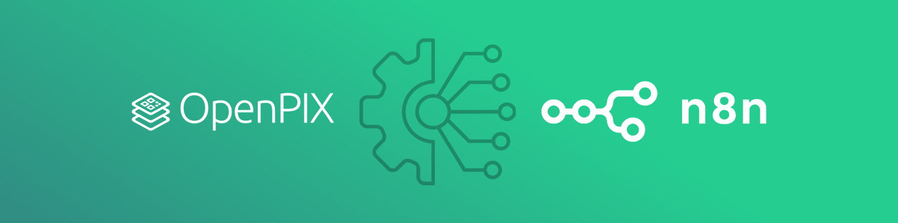

# n8n-nodes-openpix

n8n nodes for create charges and payments with [OpenPix](https://openpix.com.br)

## How to use

### Community Nodes (Recommended)

1. Go to Settings > Community Nodes.
2. Select Install.
3. Enter `n8n-nodes-openpix` in _Enter npm package name._ field.
4. Agree to the risks of using community nodes: select I understand the risks of installing unverified code from a public source.
5. Select Install.

### Manual installation

To get started install the package in your n8n root directory:

`npm install n8n-nodes-openpix`

### Setup

1. Go to Credentials.
2. Select `Add Credential` button.
3. Select `OpenPix API` from the _Search for app_ dropdown.
4. Get your OpenPix API key from [API Getting Started](https://developers.openpix.com.br/docs/apis/api-getting-started).
5. Enter your OpenPix API key in the _API Key_ field.

## Webhook signature verification

The **OpenPix Trigger** node verifies that every incoming webhook was really sent
by OpenPix, and answers `401` to anything it cannot verify.

When the node creates the webhook — or finds an existing one with the same URL —
it stores that webhook's `hmacSecretKey` in the workflow's static data and uses it
to verify the `x-openpix-signature` header (HMAC-SHA1 over the raw request body).
This needs no configuration.

Workflows created with an older version of this node have no stored secret yet, so
they keep accepting webhooks unverified. **Deactivate and reactivate the workflow**
once after upgrading to pick the secret up.

If the webhook was registered outside this node, fill the optional **Webhook Public
Key** field instead. The node then verifies the `x-webhook-signature` header
(RSA-SHA256 over the raw request body, base64). A malformed key fails closed:
every request is rejected. Get the public key from
[Webhook signature validation](https://developers.openpix.com.br/docs/webhook/web-hook-validation).

## API Reference

- [OpenPix API](https://developers.openpix.com.br/docs/apis/api-getting-started)

## Contributing

1. Fork it (<https://github.com/open-pix/n8n-nodes-openpix/fork>)
2. Create your feature branch (`git checkout -b feature/fooBar`)
3. Commit your changes (`git commit -m 'feat(fooBar) Add some fooBar'`)
4. Push to the branch (`git push origin feature/fooBar`)
5. Create a new Pull Request
